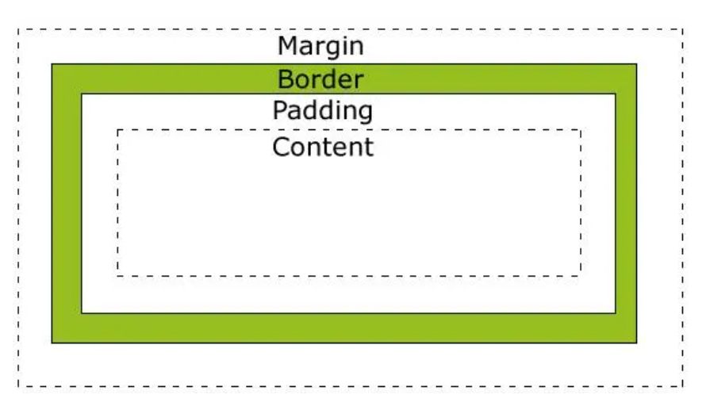

# CSS之box-sizing
- 盒模型
</img>

- box-sizing的默认值是content-box, 也就是当给一个元素设置宽或者高的时候，指定的是content的宽或者高，所有的内边距、边框、外边距都是追加到该宽度上的。（例如：width为100px,padding为10px,border为1px的元素渲染出来宽122px，width+左右padding再+左右border）
  
- box-sizing=border-box，height和width会设置为content,border,padding的大小总和，（想象一种场景：width 100% 并设置有padding 3em, 会导致折行，这个时候设置box-sizing为border-box后，内边距不会让一个元素更宽，而是让内部的内容更窄，就能在一行显示了）
  
  1.全局修改盒模型为border-box(可能会破坏带样式的第三方组件的布局)
  *,
  ::before,
  ::after{
    box-sizing:border-box  //给页面上所有元素和伪元素设置border-box
  }

  2.让全局修改盒模型为border-box（继承改盒模型会更稳妥）
  :root {
    box-sizing:border-box  //根元素设置为border-box
  }
  *,
  ::before,
  ::after{
    box-sizing:inherit;
  }

