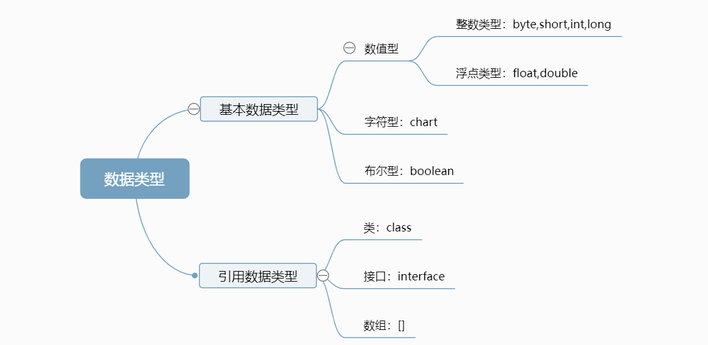
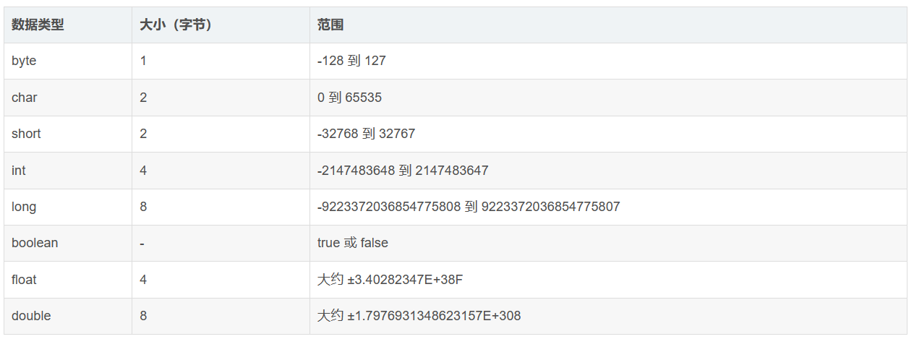

# JAVA之八大基本数据类型
## 基本数据类型介绍
JAVA语言提供了八种基本数据类型，分别是byte,short,int,long,float,double,boolean,char。
(注意：String是对象，不属于基本数据类型)

基本数据类型可分为4类：
整数型：byte,short,int,long
浮点型：float,double
字符型：char
布尔型：boolean


- 整型
JAVA的整型变量常量默认值为int型，除非不足以表示较大的数，才使用long，long型常量后面必须加“l”或“L”。
- 浮点型
浮点型无法直接由二进制表示，而是一种对于实数的近似数据表示法。
浮点型默认为double型，声明float型变量，需加“F”或者“f”。
- 字符型
JAVA中所有字符都是Unicode编码，故一个字符可以存储一个字母（两个字节）；变量初始化无默认值。
- 布尔型
只有两个值，true/false，变量初始默认值为false


## 0.1+0.2 !=0.3
计算机中只能进行二进制的计算，所以0.1 0.2计算时会先转换成二进制，然后再进行相加。
0.1+0.2 不等于 0.3 ，因为在 0.1+0.2 的计算过程中发生了两次精度丢失。第一次是在 0.1 和 0.2 转成双精度二进制浮点数时，由于二进制浮点数的小数位只能存储52位，导致小数点后第53位的数要进行为1则进1为0则舍去的操作，从而造成一次精度丢失。第二次在 0.1 和 0.2 转成二进制浮点数后，二进制浮点数相加的过程中，小数位相加导致小数位多出了一位，又要让第53位的数进行为1则进1为0则舍去的操作，又造成一次精度丢失。最终导致 0.1+0.2 不等于0.3

如何解决：
a. 将其转化成整数，运算后，再转换成小数。
b. 使用BigDecimal来进行计算。
```c
BigDecimal a = new BigDecimal("0.1");
BigDecimal b = new BigDecimal("0.2");
a.add(b); //=0.3
```